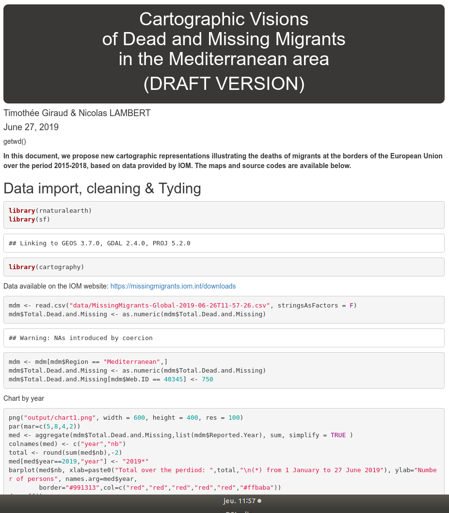

class: slide, animated, fadeIn

## INTRO

xxx

---

class: inverse, center, middle, animated, zoomIn

## Reproducible Workflow

WWW

???

Pour Tim : mets tes notes ici et appuie sur p pour les afficher ! 

---

class: slide, animated, fadeIn

## R for Spatial Analysis

---

class: slide, animated, fadeIn

## R

---

class: slide, animated, fadeIn

## R Spatial

---

class: slide, animated, fadeIn

## Ensuring Traceability and Collaborative Work

---

class: slide, animated, fadeIn

## Literate programing with Markdown

## 

---

class: slide, animated, fadeIn

## Version Control System with Git

---

class: slide, animated, fadeIn

##  xxx

---

class: slide, animated, fadeIn

## xxx

<small>Ram, 2013</small>

---

class: inverse, center, bottom, animated, zoomIn

background-image: url("img/shipwreck2.jpg")
background-size: cover

# Dead and missing migrants in the Mediterannean area

---

class: slide, animated, fadeIn

## Starting point

<small>https://www.theguardian.com</small>

---

class: slide, animated, fadeIn

## What about data?

.pull-left[

]

.pull-right[
- from 1993: United for Intercultural Action
- from 1997: Gabriele Del Grande Blog
- from 2014 to 2016: The Migrants' Files
- from 2016: International Organization for Migration (IOM)
]

---

class: slide, animated, fadeIn

## Clochard 0., 2003

---

class: slide, animated, fadeIn

## Rekacewicz P., 2006

---

class: slide, animated, fadeIn

## Migreurop, 2009, 2012, 2018, ...

---

class: inverse, center, middle, animated, zoomIn

# Reproducible approach

---

class: slide, animated, fadeIn

## Reproducible approach

---

class: slide, animated, fadeIn

## From January 2014 to June 2019

+ Apr 2015: 1222
+ May 2016: 1178
+ Jul 2014:  864
+ Sep 2014:  813
+ Nov 2016:  718

---

class: slide, animated, fadeIn

## Vision 1: proportional symbols

---

class: slide, animated, fadeIn

## Vision 2: Aggregation by cluster analysis

---

class: slide, animated, fadeIn

## Vision 3: On a 100km² resolution regular grid

---

class: slide, animated, fadeIn

## Vision 4: Smoothing (stewart method)

---

class: slide, animated, fadeIn

## Vision 4: Smoothing (stewart method)

Tanaka

---

class: slide, animated, fadeIn

## Vision 5: Inverted Smoothing (stewart method)

---

class: slide, animated, fadeIn

## Vision 5: Inverted Smoothing (A Cartographic Metaphor)

---

class: slide, animated, fadeIn

## Vision 6: Dorling Cartogram

---

class: inverse, left, top, animated, zoomIn

# Conclusion

xxx 