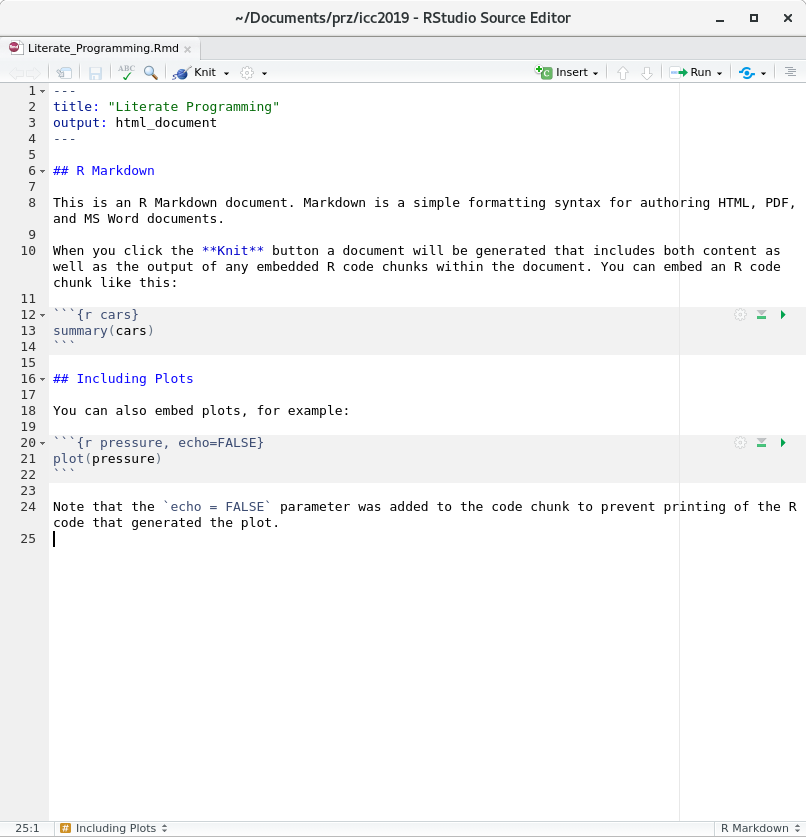
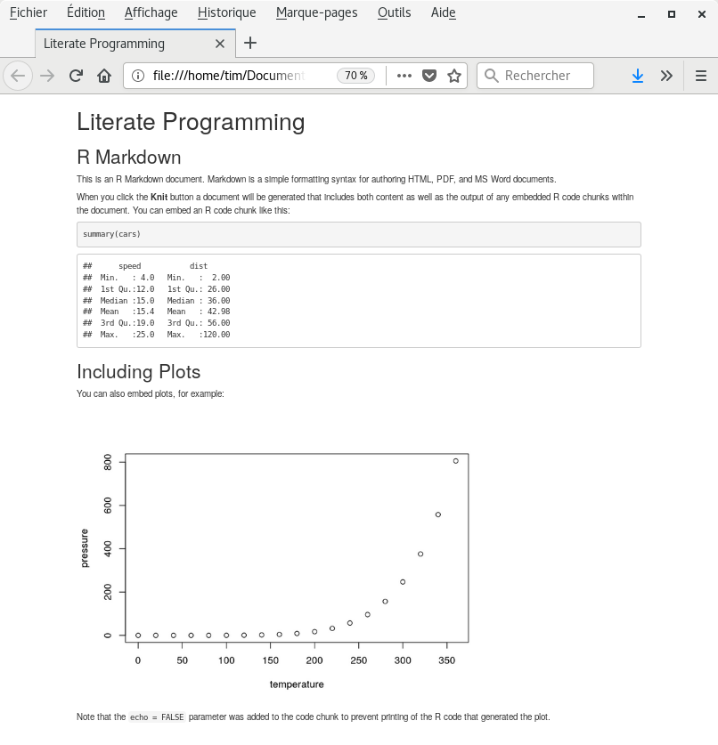
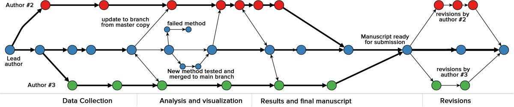
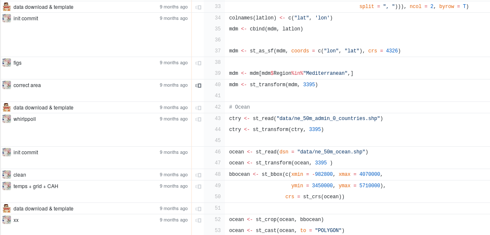
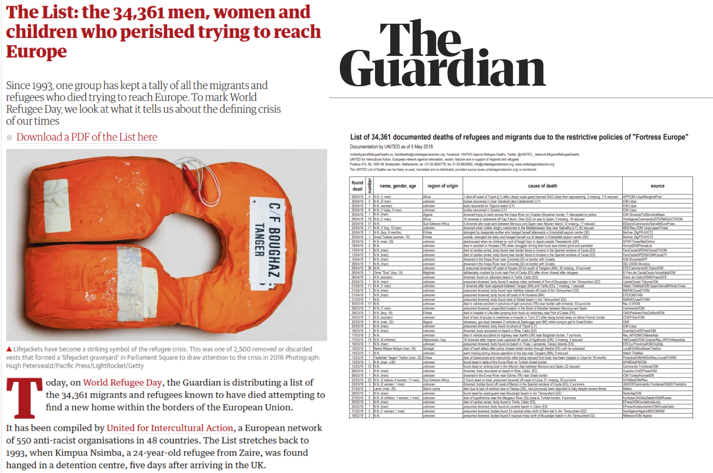
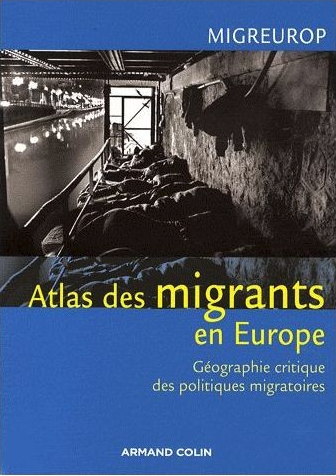
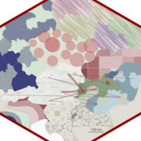

class: slide, animated, fadeIn

## INTRO

Pas indispensable
---

class: inverse, center, bottom, animated, zoomIn

background-image: url("img/361383.jpg")
background-size: cover

## Ensuring Reproducibility and Collaborative Work

---

class: slide, animated, fadeIn

## Ensuring Reproducibility and Collaborative Work with:


==> Schéma 

## A free software for statistical computing and graphics

+
 
## A literate programming solution

+

## A version control system

=
```{r, echo=FALSE}
cat("\u2764")

```


---

class: slide, animated, fadeIn

## R : a free software for statistical computing and graphics


R uses scripts based on a rich ecosystem of spatial-related libraries


---

class: slide, animated, fadeIn

## RMarkdown: a literate programming solution


---

class: slide, animated, fadeIn

## RMarkdown: a literate programming solution


---

class: slide, animated, fadeIn

## Git: a Version Control System


<small>Ram, 2013</small>

---
class: slide, animated, fadeIn

## Git: a Version Control System




---

class: inverse, center, bottom, animated, zoomIn

background-image: url("img/shipwreck2.jpg")
background-size: cover

# Dead and missing migrants in the Mediterannean area

---

class: slide, animated, fadeIn

## Starting point


<small>https://www.theguardian.com</small>

???

xxx

---

class: center, slide, animated, fadeIn

background-image: url("img/clochard.png")
background-size: cover

## Clochard 0., 2003

???

The first map of dead migrants at the borders of the European Union was created in 2003 by the French geographer Olivier Clochard. 

The principle of this map is simple. It combines quantitative information: the number of dead and missing migrants represented by the surface of the circles. And qualitative information: the cause of death represented by color. 

This was the first time this data had been mapped.

---

class: slide, animated, fadeIn


background-image: url("img/reka.png")
background-size: cover

## Rekacewicz P., 2006

???

In 2006, Olivier Clochard's work was reworked by cartographer Philippe Rekacewicz to be published in a French newspaper: Le Monde diplomatique. 

---

class: slide, animated, fadeIn

background-image: url("img/map2009.png")
background-size: cover

## Migreurop, 2009



???

Then, this map, always made according to the same principles, was updated many times by the cartographers of the Migreurop network

---

class: slide, animated, fadeIn

background-image: url("img/map2012.png")
background-size: cover

## Migreurop, 2012


---

class: slide, animated, fadeIn

background-image: url("img/map2015.png")
background-size: cover

## Migreurop, 2015

---

class: slide, animated, fadeIn

background-image: url("img/map2017.png")
background-size: cover

## Migreurop, 2017


---


class: slide, animated, fadeIn

## What about data?


???

When the first map was produced, there were no official data. The authors had to rely on militant data, the only data available, collected by the Dutch NGO, United against Racism, which has been collecting press reports since 1993 listing migrants who have disappeared in Europe and its neighbourhood.

The second source of data comes from the Fortress Europe blog of the Italian journalist Gabriele Del Grande, which also lists the deaths at the borders. This work began in 1997 and ended in February 2016.

In 2014, a collective of European journalists from 15 different countries called "the migrant's file" was created. Their work consisted mainly of searching the two databases mentioned above, checking each event and cross-referencing data to avoid duplication. In the end, there are not so many duplicates, and it can be seen that the number of deaths has so far been largely underestimated. This data journalism work was awarded. The database ends in mid-2016.

---


class: slide, animated, fadeIn

## What about data?


???

Today, the main source of data comes from the International Organization for Migration (IOM), which launched its death and missing migrants platform in 2014. The data is "official" and daily updated. 

---

class: slide, animated, fadeIn

## Reproducible approach

<!-- <iframe src="http://localhost/MDM/" frameborder="0" allowfullscreen="true" width="100%" height="80%"> </iframe> -->

---

class: center, slide, animated, fadeIn


## From January 2014 to June 2019


.center[
Month   | Nb. of Dead and Missing Migrants 
------------- | -------------
Apr 2015 | 1222
May 2016  | 1178
Jul 2014  | 864
Sep 2014  | 813
]

???

The most deadly year is 2016.

The most deadly month is April 2015 (in the middle of what was called the migration crisis).

---

class: slide, animated, fadeIn

## Vision 1: proportional symbols


.center[
  | 
------------- | -------------
All known shipwrecks are displayed | Overlay of symbols
The location of each shipwreck is correct.| 
]

---

class: slide, animated, fadeIn

## Vision 2: Aggregation by cluster analysis


.center[
  | 
------------- | -------------
Good overview  | We can't see every shipwreck
Allows to know the values by migration route  | Each stories are grouped together
]

---

class: slide, animated, fadeIn

## Vision 3: On a 100km² resolution regular grid


.center[
  | 
------------- | -------------
Good overview | Not natural representation
Allows to detect the most dangerous areas (Libyan coasts) | Does not allow to consider the quantities
]

---

class: slide, animated, fadeIn

## Vision 4: Smoothing (stewart method)


.center[
  | 
------------- | -------------
highlights geographical structures  | The meaning of values is difficult to interpret
Allows to locate the most dangerous areas  |
]

---

class: center, slide, animated, fadeIn

## Vision 4: Smoothing (stewart method)


.pull-left[

]

.pull-right[
The **`tanaka` package** has been released on CRAN. This package is a simplified implementation of the Tanaka method.
]

---

class: slide, animated, fadeIn

## Vision 5: Inverted Smoothing (stewart method)


.center[
  | 
------------- | -------------
highlights geographical structures   | xxx
Allows to locate the most dangerous areas  | xxx
]


---

class: slide, animated, fadeIn

## Vision 5: Inverted Smoothing (stewart method)


.center[
  | 
highlights geographical structures   | xxx
Allows to locate the most dangerous areas  | xxx
]


---

class: slide, animated, fadeIn

## Vision 6: Dorling Cartogram


.center[
  | 
------------- | -------------
Good overview  | The location of the shipwrecks is inaccurate
All known shipwrecks are displayed | 
]

---

class: inverse, top, center, animated, zoomIn

# Conclusion


---

class: center, middle

# Thanks!


.pull-left[
<br/><br/>
[**Timothée Giraud**](https://rgeomatic.hypotheses.org/)<br/>timothee.giraud@cnrs.fr<br/>rgeomatic.hypotheses.org<br/>@rgeomatic

]

.pull-right[
<br/><br/>
[**Nicolas Lambert**](https://neocarto.hypotheses.org/)<br/>nicolas.lambert@cnrs.fr<br/>neocarto.hypotheses.org<br/>@neocartocnrs
]

<br/><br/><hr/>

Maps and code sources are available on github:[**riatelab.github.io/MDM**](https://riatelab.github.io/MDM/).<br/>Test by yourself!

<hr/>