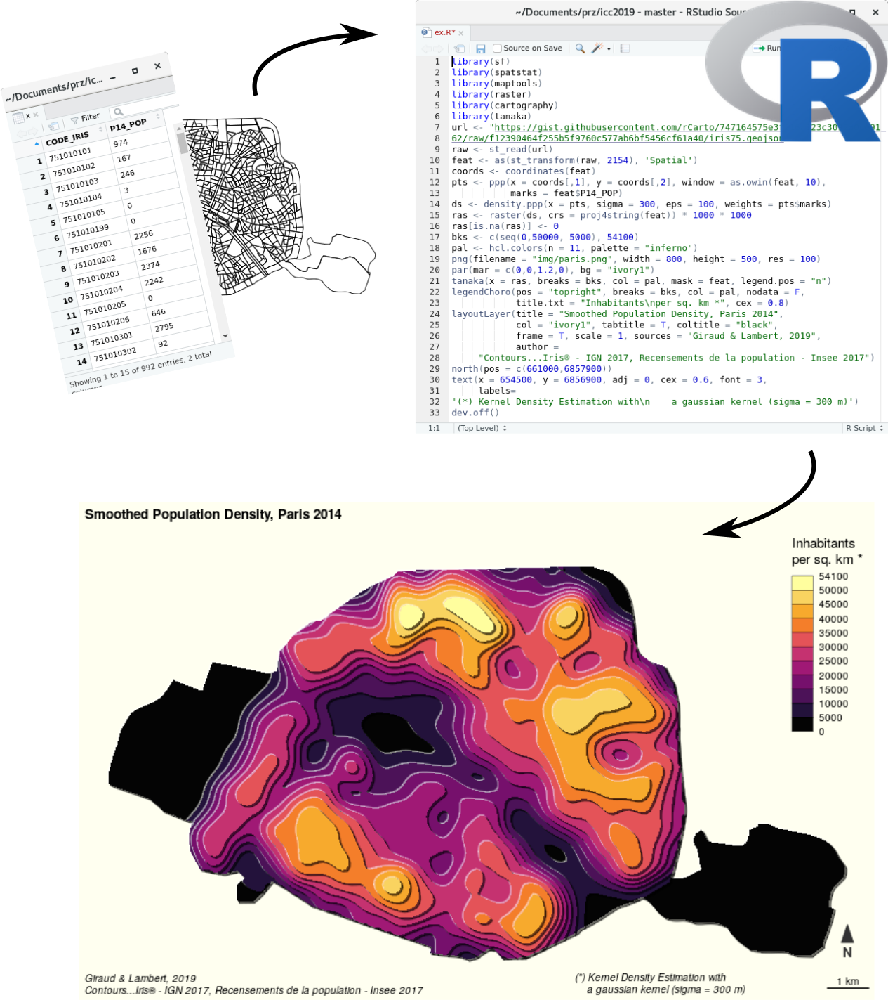
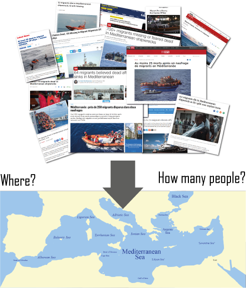

class: inverse, center, bottom, animated, zoomIn

background-image: url("img/361383.jpg")
background-size: cover

## Ensuring Reproducibility and Collaborative Work

---

class: slide, animated, fadeIn

## Ensuring Reproducibility and Collaborative Work with:

### A free software for statistical computing and graphics

### A literate programming solution

### A version control system

---

class: slide, animated, fadeIn

## R : a free software for statistical computing and graphics

.center[
   
]

???
R uses scripts based on a rich ecosystem of spatial-related libraries

---

class: slide, animated, fadeIn

## RMarkdown: a literate programming solution
.center[

]
---

class: slide, animated, fadeIn

## RMarkdown: a literate programming solution

.center[

]

---

class: slide, animated, fadeIn

## Git: a Version Control System

.center[

<small>Ram, 2013</small>
]

---
class: slide, animated, fadeIn

## Git: a Version Control System

.center[

]

---

class: inverse, center, bottom, animated, zoomIn

background-image: url("img/shipwreck2.jpg")
background-size: cover

# Dead and missing migrants in the Mediterannean area

???

We will now see how it is possible to apply this type of framework on a geographical issue that is currently the subject of much discussion in Europe: the migration question. And in particular, the issue of the dead and missing in the Mediterranean.

---

class: center, slide, animated, fadeIn

## Starting point

???

Actually, we have a lot of information on this topic for a long time. It is often reported in the medias. But this subject has long been treated in a succession of special events (news).

---

class: center, slide, animated, fadeIn

## Starting point

???

The contribution of geographers is to spatialize the view on this phenomenon in order to decrypt its logic. 

---

class: center, slide, animated, fadeIn

background-image: url("img/clochard.png")
background-size: cover

## Clochard 0., 2003

???

The first map of dead and missing migrants at the borders of the European Union was created in 2003 by the French geographer Olivier Clochard. 

The principle of this map is simple. It combines quantitative information: the number of dead and missing migrants represented by the surface of the circles. And qualitative information: the cause of death represented by color. 

This was the first time this data had been mapped.

---

class: slide, animated, fadeIn

background-image: url("img/reka.png")
background-size: cover

## Rekacewicz P., 2006

???

In 2006, Olivier Clochard's work was redesigned by cartographer Philippe Rekacewicz to be published in a French newspaper: Le Monde diplomatique. 

---

class: slide, animated, fadeIn

background-image: url("img/map2009.png")
background-size: cover

## Migreurop, 2009

???

Then, this map, always made according to the same principles, was updated many times by the cartographers of the Migreurop network. In 2009

---

class: slide, animated, fadeIn

background-image: url("img/map2012.png")
background-size: cover

## Migreurop, 2012

???
In 2012

---

class: slide, animated, fadeIn

background-image: url("img/map2015.png")
background-size: cover

## Migreurop, 2015

???
In 2015

---

class: slide, animated, fadeIn

background-image: url("img/map2017.png")
background-size: cover

## Migreurop, 2017

???
In 2017

---

class: slide, animated, fadeIn

## What about data?

???

When the first map was produced, there were no official data. The authors had to rely on militant data, the only data available, collected by the Dutch NGO, United against Racism, which has been collecting press reports since 1993 listing migrants who have disappeared in Europe and its neighbourhood.

The second source of data comes from the Fortress Europe blog of the Italian journalist Gabriele Del Grande, which also lists the deaths at the borders. This work began in 1997 and ended in February 2016.

In 2014, a collective of European journalists from 15 different countries called "the migrant's file" was created. Their work consisted mainly of searching the two databases mentioned above, checking each event and cross-referencing data to avoid duplication. In the end, there are not so many duplicates, and it can be seen that the number of deaths has so far been largely underestimated. This data journalism work was awarded. The database ends in mid-2016.

---

class: slide, animated, fadeIn

## What about data?

???

Today, the main source of data comes from the International Organization for Migration (IOM), which launched its death and missing migrants platform in 2014. The data is "official" and daily updated. 

---

class: slide, animated, fadeIn

## Reproducible approach

 <iframe src="https://riatelab.github.io/MDM/" frameborder="0" allowfullscreen="true" width="100%" height="80%"> </iframe>

???

The aim of this presentation is to demonstrate how it is possible to produce maps of migrants who died in the Mediterranean in a reproducible research approach. 

On the screen here, you can see an overview of the R program (commented in Markdown), which have produced the maps that I will now present to you.  These programs, as well as this presentation, were realized in a collaborative way by Nicolas Lambert and myself and are now and already online on the github platform. 

---

class: slide, animated, fadeIn

## Vision 1: proportional symbols

.center[
  | 
------------- | -------------
All known shipwrecks are displayed | Overlay of symbols
The location of each shipwreck is correct.| 
]

???
This first map is a very classic map with a symbolisation bay proportionnal symbols.  Each circle corresponds to a shipwreck. The surface area of the circles corresponds to the number of people who have died or gone missing since 1 January 2014. 

This map allows us to identify the most deadly locations for migrants. Gibraltar. The Aegean Sea. And mainly off the Libyan coast towards Italy. 

A problem: there is a lot of overlapping of symbols. A large part of the information is hidden.  

---

class: slide, animated, fadeIn

## Vision 2: Aggregation by cluster analysis

.center[
  | 
------------- | -------------
Good overview  | We can't see every shipwreck
Allows to know the values by migration route  | Each stories are grouped together
]

???
This second map provides an aggregation of data according to location. The method, based on a cluster analysis on geographical coordinates, makes it possible to show the importance of the phenomenon for each migration route. More than thirteen thousand between Libya and Italy in 5 years. 

A disadvantage: the map no longer allows to see the number of shipwrecks. 

---

class: slide, animated, fadeIn

## Vision 3: On a 100km² resolution regular grid

.center[
  | 
------------- | -------------
Good overview | Not natural representation
Allows to detect the most dangerous areas (Libyan coasts) | Does not allow to consider the quantities
]

???

This map is based on the aggregation method on a regular grid. This map gives an overview of the phenomenon and makes it possible to identify the most dangerous areas. Here, off the Libyan coast, in this square. 

From a political point of view, this map alerts to the need for rescue operations in Libyan territorial waters. 

weak point: this type of map does not reflect quantities. 

---

class: slide, animated, fadeIn

## Vision 4: Smoothing (stewart method)

.center[
  | 
------------- | -------------
highlights geographical structures  | We can't see every shipwreck
Allows to locate the most dangerous areas  | Does not allow to consider the quantities
]

???

This map is the most complicated even if its appearance is very simple. It was realized through the Stewart's method of potentials, which consists in calculating at any point in space, the number of dead or missing persons in a given neighbourhood. For more details, you can consult the literature on bibliography at the end of our paper.

As before, this map makes it possible to identify the most dangerous areas and to set up a simple geographical organisation, easily understable. 

The originality of this map also resides in the use of the Tanaka method, which gives this relief effect. 

---

class: center, slide, animated, fadeIn

## Vision 4: Smoothing (stewart method)

.pull-left[

]

.pull-right[
The **`tanaka` package** has been released on CRAN. This package is a simplified implementation of the Tanaka method.
]

???

Note that the Tanaka method was used in the logo of this conference.

---

class: slide, animated, fadeIn

## Vision 5: Inverted Smoothing (stewart method)

.center[
  | 
------------- | -------------
highlights geographical structures   | We can't see every shipwreck
Allows to locate the most dangerous areas  | Does not allow to consider the quantities
]

???
In the R program, the previous map can be easily modified by inverting the values and changing the colors. 

---

class: slide, animated, fadeIn

## Vision 5: Inverted Smoothing (stewart method)

.center[
  | 
------------- | -------------
highlights geographical structures   | We can't see every shipwreck
Allows to locate the most dangerous areas  | Does not allow to consider the quantities
]

???
Thus a map appears where the Mediterranean Sea is turned into a vast whirlpool in which the migrants disappear. A kind of cartographic metaphor that reminds us of newspaper pictures. 

---

class: slide, animated, fadeIn

## Vision 6: Dorling Cartogram

.center[
  | 
------------- | -------------
Good overview  | The location of the shipwrecks is inaccurate
All known shipwrecks are displayed | 
]

???
Finally, this sixth map, which uses the Dorling method, has a double advantage. It allows both to identify the number of dead and missing persons in each shipwreck and to show the extent of the phenomenon for each migration route. Here, no circles are overlaid.

The only disadvantage is that the geographical location of the shipwrecks is not accurate.

---

class: inverse, top, center, animated, zoomIn

# Conclusion

???

In conclusion, we can say that no map is 100% efficient. Each map has strengths and weaknesses. Each map focuses on one aspect of the data rather than another. Multi-representation makes it possible to show the complexity of a geographical phenomenon in various aspects. The multiplicity of maps allows a better understanding of geographical phenomena. 

Second element of conclusion: reproducible processes allows:
- maps to be updated easily and quickly. 
- several people to work together
- transparency and tracability
- maps and methods to be shared

---

class: center, middle

# ありがとうございます 

.pull-left[
  
[**Timothée Giraud**](https://rgeomatic.hypotheses.org/) timothee.giraud@cnrs.fr rgeomatic.hypotheses.org @rgeomatic

]

.pull-right[
  
[**Nicolas Lambert**](https://neocarto.hypotheses.org/) nicolas.lambert@cnrs.fr neocarto.hypotheses.org @neocartocnrs
]

  

Maps and code sources are available on github: [**riatelab.github.io/MDM**](https://riatelab.github.io/MDM/). Test by yourself!

???
If you want to know more or reproduce these examples by yourself, the source code of the maps are available online at this link.

Thank you. 
