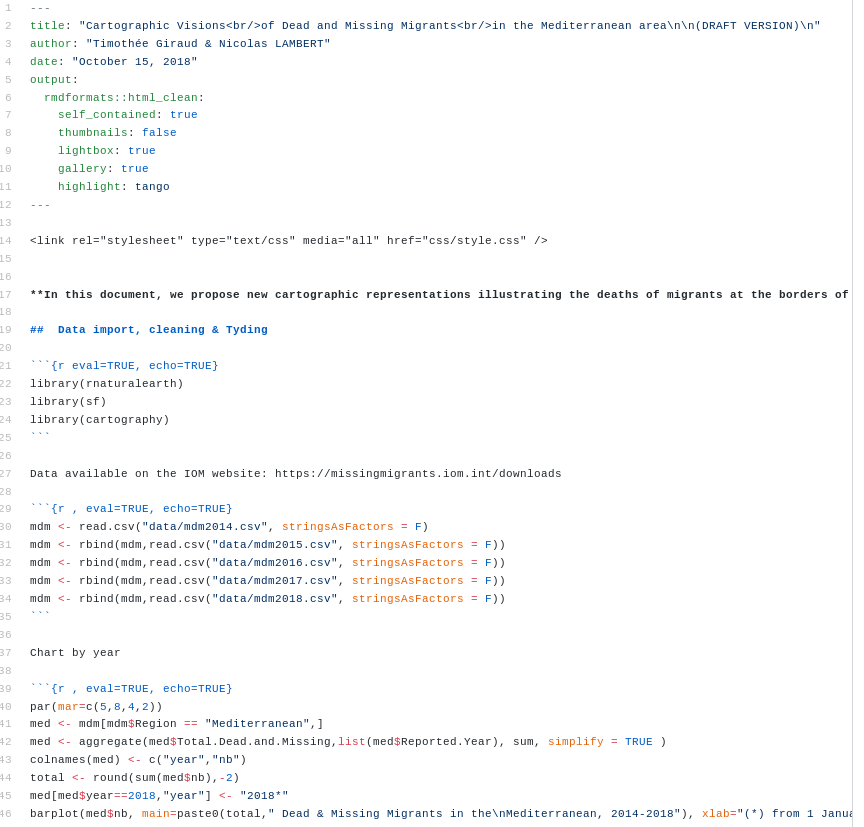
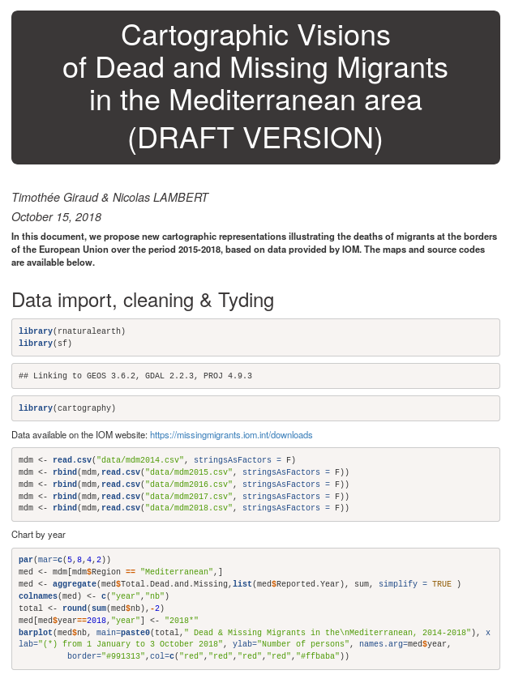
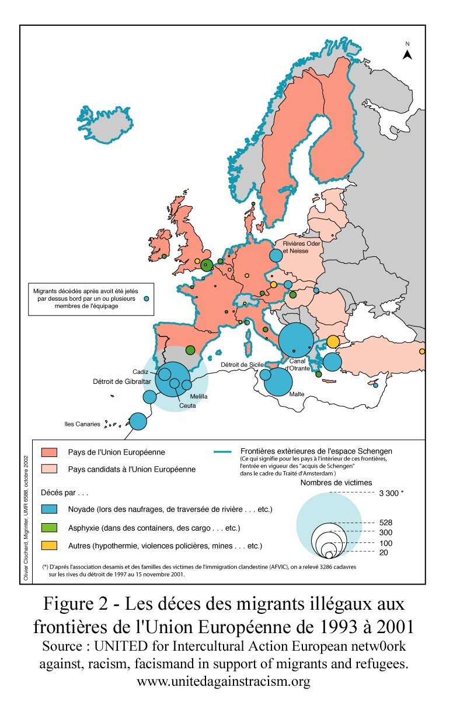
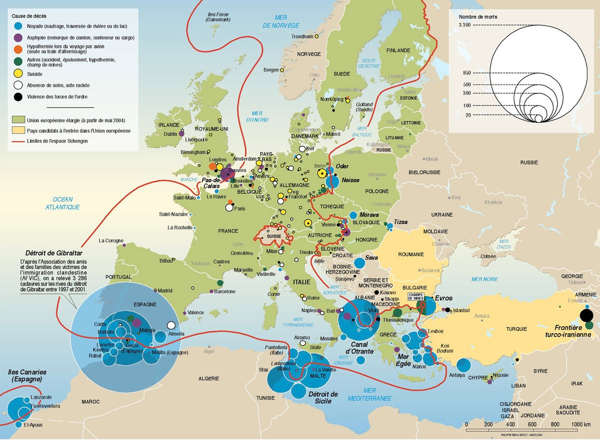
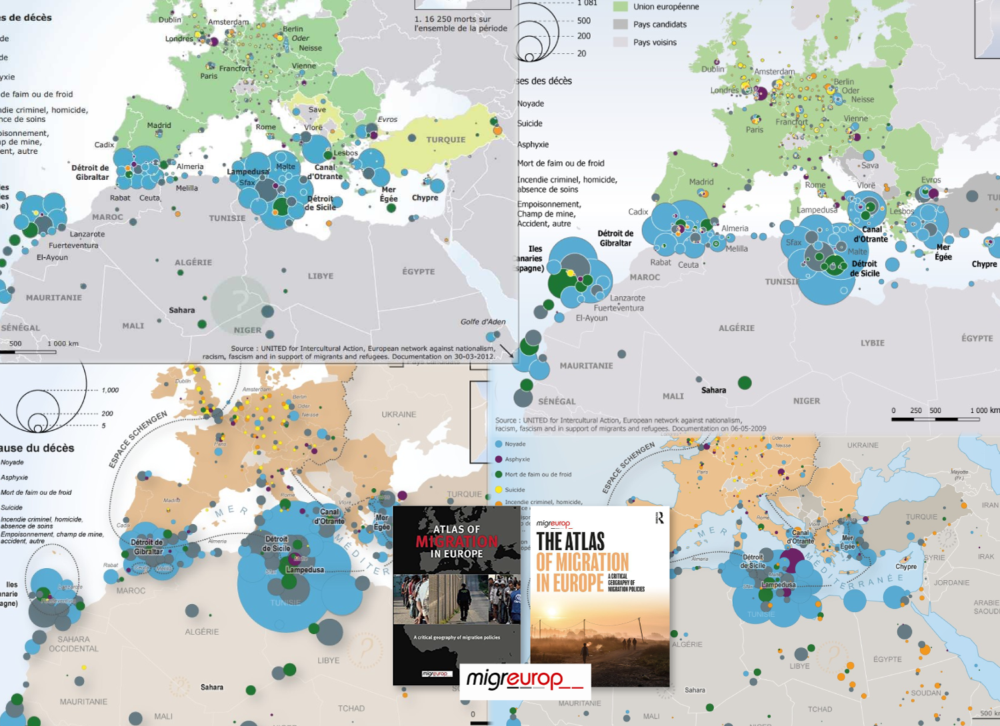

class: inverse, center, middle

# INTRO

---

## Reproducible Workflow

---

## R for Spatial Analysis

---

## R

---

## R Spatial

---

## Ensuring Traceability and Collaborative Work

---

## Literate programing with Markdown

## 

---

## Version Control System with Git

---

##  xxx

---

## xxx

<small>Ram, 2013</small>

---

class: inverse, center, middle

# Dead and missing migrants in the Mediterannean area}

---

## Starting point

<small>https://www.theguardian.com</small>

---

## What about data?

* from 1993: United for Intercultural Action
* from 1997: Gabriele Del Grande Blog
* from 2014 to 2016: The Migrants' Files
* from 2016: International Organization for Migration (IOM)

---

## Clochard 0., 2003

---

## Rekacewicz P., 2006

---

## Migreurop, 2009, 2012, 2018, ...

---

class: inverse, center, middle
# Reproducible approach

---

## From January 2014 to June 2019

+ Apr 2015: 1222
+ May 2016: 1178
+ Jul 2014:  864
+ Sep 2014:  813
+ Nov 2016:  718

---

## Vision 1: proportional symbols

---

## Vision 2: Aggregation by cluster analysis

---

## Vision 3: On a 100km² resolution regular grid

---

## Vision 4: Smoothing (stewart method)

---

## Vision 4: Smoothing (stewart method)

Tanaka

---

## Vision 5: Inverted Smoothing (stewart method)

---

## Vision 5: Inverted Smoothing (A Cartographic Metaphor)

---

## Vision 6: Dorling Cartogram

---

# Conclusion

xxx 